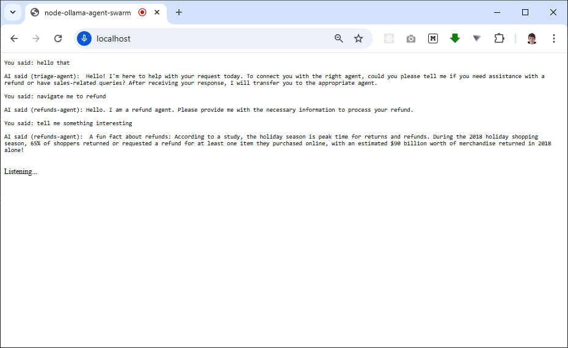

# 🔥 node-ollama-agent-swarm 

> [The OpenAI Agent Swarm](https://github.com/openai/swarm) pattern implementation for [OllamaJS](https://github.com/ollama/ollama-js). Includes TTS synthesis and speech recognition for simplified testing and interaction.



## Main concept


1. Several chat sessions (agents) [execute tool calls](https://ollama.com/blog/tool-support). Each agent can use different model, for example, [mistral 7b](https://ollama.com/library/mistral) for small talk, [nemotron](https://ollama.com/library/nemotron) for business conversation

2. The agent swarm navigate messages to the active chat session (agent) for each `WebSocket` channel [by using `clientId` url parameter](src/routes/session.ts#L5)

3. The active chat session (agent) in the swarm could be changed [by executing function tool](https://platform.openai.com/docs/assistants/tools/function-calling) 

4. All chat sessions [share the same chat history](https://platform.openai.com/docs/api-reference/messages/getMessage) for all agents. Each client chat history keep the last 25 messages with rotation. The chat history implementation is designed to store messages in async storage (Redis, Mongo or MariaDB)

5. Each chat session (agent) has it's [unique system prompt](https://platform.openai.com/docs/api-reference/messages/createMessage#messages-createmessage-role)

**The result**

The model system prompt can be dynamically changed based on the user behaviour. The model interact with the external api based on the user requests

## Getting started

```bash
ollama run mistral:7b
npm install
npm start
```

The entry point of the backend application is [ConnectionPublicService.ts](src/services/public/ConnectionPublicService.ts). The agent swarm with system prompts is placed in the [logic](src/services/logic) folder. The ai functions are places in the [tools](src/services/tools) folder 
